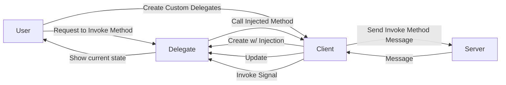

# PENNE
Python Client for NOODLES protocol  
(Python Encoded Native NOODLES Endpoint)

## Description
Client implementing the NOODLES messaging protocol for communicating with serverside data visualisation applications.
The client uses a websocket connection to send CBOR encoded messages. To customize its implementation, the
library offers hooks in the form of delegates which can be overwritten with new methods.

## How does the client work?
When a message is received from the server, the client passes the CBOR encoded message to a handler function which uses
the message's ID to process it accordingly. Based on this ID, the message can be classified as either a create, delete, 
update, reply, or invoke message. Upon receiving a create message, the handler creates a new delegate for that object
which is then stored in the client's state. Delete and update messages manipulate delegates in the client's state as expected.
Reply messages indicate whether a method was invoked on the server successfully, and then a callback function can be executed if applicable.
Lastly, invoke messages represent signals from the server which are being called on a delegate. The handler essentially sends this signal
to the target delgate so it can call a corresponding function. 

To send a message, the user calls a method on a delegate. This method wraps an injected method from the server, and the client can send 
a message invoking the method.

A diagram representing the simplified relationships between the client, server, and delegates is depicted below. 



## Working with delegates
>What are delegates? 

NOODLES messages deal with many different objects ranging from tables and plots to lights and materials. To help with 
using these objects, each type has its own delegate class. Each object in a scene corresponds with an instance of a delegate
which is stored in the client's state. Delegates provide methods specific to each type of object.

Note: PENNE currently offers support primarily for the table delegate class

>How can I use custom delegates?

To work with your own delegates, use a custom delegate hash in `create_client()`. To overide a default
delegates use the same key in your dictionary.

### Tables
The table delegate comes with several built in methods covering basic table manipulation. The delegate includes...
```python
request_insert(col_list: list=None, row_list: list=None, on_done=None)
request_remove(keys: list, on_done=None)
request_update(data_frame: pandas.DataFrame, on_done=None)
request_clear(on_done=None)
request_update_selection(name: str, keys: list, on_done=None)
plot()
```
Once invoked, signals from the server will update the table in the delegate. When using these methods, the user has the option of including a callback function that will execute once complete.

## Helpful Methods
To get started, the user can call `show_methods()` on the client

## Getting Started
1. Install the library
2. Create a client using `create_client(address, delegate_hash)`
    - Specify the websocket URL as the address
    - (Optional) use delegate hash to map custom delegates
3. Explore and manipulate data on the server using client or delegate methods
    - call `show_methods()` on the client to see a list of available methods with documentation
    - call `show_methods()` on a delegate to see a list of available methods for that instance
