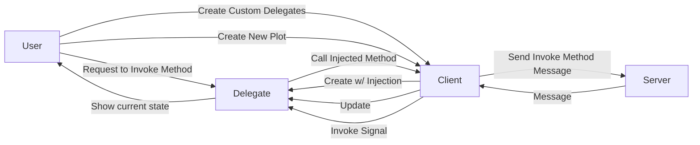

# PENNE


Python Client for NOODLES protocol  
(Python Encoded Native NOODLES Endpoint)

## Description
The client library is based on the NOODLES messaging protocol for communicating with serverside data visualisation applications. The client uses a websocket connection to send CBOR encoded messages. To customize its implementation, the
library offers hooks in the form of delegates classes which can be extended and overwritten.

## How does the client work?
When a message is received from the server, the client passes the CBOR encoded message to a handler function which uses
the message's ID to process it accordingly. Based on this ID, the message can be classified as either a create, delete, 
update, reply, or invoke message. Upon receiving a create message, the handler creates a new delegate for that object
which is then stored in the client's state. Delete and update messages manipulate delegates in the client's state as expected. Reply messages indicate whether a method was invoked on the server successfully, and then a callback function can be executed if applicable. Lastly, invoke messages represent signals from the server which are being called on a delegate. The handler essentially sends this signal to the target delgate so it can call a corresponding function. 

To send a message, the user calls a method on a delegate. This method wraps an injected method from the server, and the client can send a message invoking the method.

A diagram representing the simplified relationships between the client, server, and delegates is depicted below. 



## Working with delegates
>What are delegates? 

NOODLES messages deal with many different objects ranging from tables and plots to lights and materials. To help with 
using these objects, each type has its own delegate class. Each object in a scene corresponds with an instance of a delegate
which is stored in the client's state. Delegates provide methods specific to each type of object.

Note: PENNE currently offers support primarily for the table delegate class

>How can I use custom delegates?

To work with your own delegates, use a custom delegate hash as an argument in `create_client()`. To overide a default
delegate, use the same key in your dictionary. The library also provides a generic `Delegate` class that
should be used as the parent class for any delegate. An example of a custom delegate is included in `test_client.py`. Here, the delegate class inherits from `TableDelegate` and uses the pandas library to add table and plotting functionality. 

>How do you call methods on a delegate?

Once instantiated, delegates are injected with methods designated by the server. These methods can be called by using
public methods on the delegate that essentially wrap the injected ones. Once the method is invoked, the server will 
respond with a signal that updates the client. Each signal is linked to a method in the delegate which keeps the state of 
the client up to date. To customize the client's behavior, these methods can be overwritten in a custom delegate. Each 
public method also accepts a callback function to be executed once a response is received from the server. This way, method calls can be chained together and run in sequence. An example is provided in `test_client.py`.

### Tables
The table delegate comes with several built in methods covering basic table manipulation. The delegate includes...
```python
request_insert(col_list: list=None, row_list: list=None, on_done=None)
request_remove(keys: list, on_done=None)
request_update(data_frame: pandas.DataFrame, on_done=None)
request_clear(on_done=None)
request_update_selection(name: str, keys: list, on_done=None)
```
Once invoked, signals from the server will update the table in the delegate. When using these methods, the user has the option of including a callback function that will execute once complete.

## Getting Started
1. Install the library
```python
pip install penne
```
2. Create a client using `create_client(address, delegate_hash)`
```python
from penne import Client

with Client(address, delegate_hash) as client:
    # do stuff
```
- (Optional) use delegate hash to map custom delegates
- This is the recommended way to create a client as it will automatically close the connection when the client goes out of scope
- It also manages an 'is_active' flag to signify whether the connection is open and the client is still running
  - This can be used to poll for callbacks
- However, you can also instantiate the client and manage the communication thread manually
```python
client = Client(address, delegate_hash)
client.thread.start()  # Starts websocket connection in new thread
client.connection_established.wait() 
# do stuff
client.shutdown()  # Close websocket connection
client.thread.join()
```
3. Explore and manipulate data on the server using client or delegate methods
- call `show_methods()` on the client to see a list of available methods with documentation
- call `show_methods()` on a delegate to see a list of available methods for that instance
