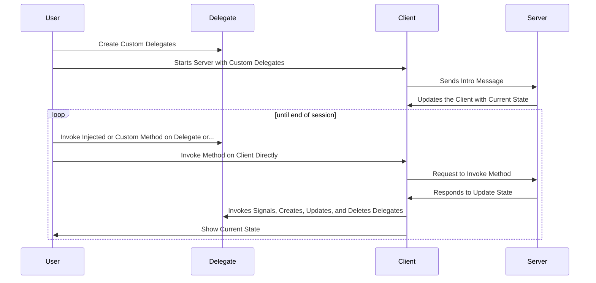

# Overview


[](https://htmlpreview.github.io/?https://github.com/InsightCenterNoodles/Penne/blob/python-coverage-comment-action-data/htmlcov/index.html)

Penne is the first client library to implement the NOODLES messaging protocol in Python. NOODLES allows multiple client
applications to interact collaboratively with data in real-time. The client uses a websocket connection to send CBOR 
encoded messages, and all components in the scene graph can be subclassed and customized to fit an application's 
needs. 

<video autoplay loop src="assets/demo.mov">  video </video> 
<figcaption>Penne used as the foundation for Orzo's 3d visualizations</figcaption>


## Why use Penne?

Penne is a great choice for anyone who wants to use the NOODLES protocol while working in Python. With a client
application to display methods and data, users will be able to interact with data from any server that
implements the NOODLES protocol. Penne offers a simple interface for handling messages and customizing components
in a scene. If you are looking to use NOODLES with a different language, there is currently support for C++, Rust, 
Julia, and Javascript [here](https://github.com/InsightCenterNoodles/), and if you are looking to build a server in 
Python, check out [Rigatoni](https://insightcenternoodles.github.io/Rigatoni/).

## How does the client work?



When a message is received from the server, the client passes the CBOR encoded message to a handler function which uses
the message's ID to process it accordingly. Based on this ID, the message can be classified as either a create, delete, 
update, reply, or invoke message. Upon receiving a create message, the handler creates a new delegate for that object
which is then stored in the client's state. Delete and update messages manipulate delegates in the client's state as expected. 
Reply messages indicate whether a method was invoked on the server successfully, and then a callback function can be 
executed if applicable. Lastly, invoke messages represent signals from the server which are being called on a delegate. 
The handler sends this signal to the target delegate so it can call a corresponding function. 

To send a message, the user calls a method on a delegate or the document more broadly. Delegates may have injected 
methods from the server, and the client can send a message invoking the method. For example, the server can define a
method like insert_row() on a table delegate. The client can then call this method on the delegate, and the server will
get a message requesting to invoke the method. The server will then respond by updating the state, invoking signals, 
and sending a reply message to the client. If the server is unable to invoke the method, it will send a reply message
that contains an exception.


## Getting Started
1. Install the library
```python
pip install penne
```
2. Create a client using 
```python
from penne import Client

with Client(address, delegate_hash) as client:
    # do stuff
```
- (Optional) use delegate hash to map custom delegates
- This is the recommended way to create a client as it will automatically close the connection when the client goes out of scope
- It also manages an 'is_active' flag to signify whether the connection is open and the client is still running
  - This can be used to poll for callbacks
- However, you can also instantiate the client and manage the communication thread manually
```python
client = Client(address, delegate_hash)
client.thread.start()  # Starts websocket connection in new thread
client.connection_established.wait() 
# do stuff
client.shutdown()  # Close websocket connection
client.thread.join()
```
3. Explore and manipulate data on the server using client or delegate methods
- call `show_methods()` on the client to see a list of available methods with documentation
- call `show_methods()` on a delegate to see a list of available methods for that instance
