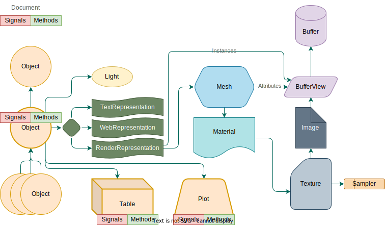

# What is NOODLES?

>NOODLES is a messaging protocol for interactive visualizations. Client and server libraries can implement the protocol
to allow for real-time collaboration across visually rich applications.

As an intern with little experience in the field of data visualiation and computer graphics, I struggled at first
to understand what exactly NOODLES is about and what it aims to accomplish. This document aims to help explain the
project to newcomers with all that I have learned while working on Penne, Rigatoni, and Orzo.

NOODLES is at its core is a messaging protocol. This is simply an agreement between client and server applications, so 
they can communicate in a standardized way. The ultimate goal is to allow for real-time collaboration across different
devices or client applications. For example, researchers could all be working on the same data set at the same time 
while visualizing it from a web browser, a VR headset, or a command line interface. Researchers no longer would have
to set up their data in a specific way to work with a particular visualization tool. Instead, they could use NOODLES
to connect their data to any tool that implements the protocol. The NOODLES protocol would be the 
bridge between these different tools and devices.

While NOODLES specifically refers to the protocol that defines the types of messages that can be sent, this project
includes client and server libraries that implement the protocol in a specific language. That way, users can use the 
protocol in their language of choice. As of writing this, there is support for python, rust, c++, javascript, and julia.

## Breaking down a NOODLES session

A NOODLES session is composed of a server and one or more clients. A server hosts data and handles requests from clients
to manipulate that data. Clients connect to the server with an introductory message
and can request data from the server or send messages to the server
to invoke methods that manipulate the data. The server then sends updates to all connected clients to keep them in sync.

### Objects in a Session

If you look at the [message specification](https://github.com/InsightCenterNoodles/message_spec), you'll notice that
the messages follow a pattern. In general, most messages signal the creation, deletion, or modification of an object.
These objects include lights, geometries, buffers, and more. These objects are all used to compose a scene that can be 
rendered in 3d. Below is a diagram that shows the basic layout of the scene graph. For information on each type of 
object, check out the latter half of this [page](api_reference/delegates.md).

### Methods and Signals

The server defines methods that can be invoked by clients to manipulate the data. For the client this is like getting a
menu at a restaurant. If the client invokes a method to say add a point to a data table, the server will process that 
message then send a signal to all connected clients to let them know that the data has been updated. The server will
also send a reply to let the client know whether the method invocation went through alright.

## A sphere's journey

To get an idea of how all of these pieces come together to get something 3d to show up on a screen, I figured it would
be helpful to walk through an example. Consider the humble sphere...

First a server application will define some methods that create the sphere, or maybe it will already be present in
the server's starting state. This is a problem for the server application which would use the support of a server 
library to make this happen. The client connects to the server's websocket address with an intro message, and the server
sends back a series of messages to catch the client up to the server's current state. In this example, that would include
an entity create message for the general entity that would hold the sphere. Entities are essentially containers that 
house lights, geometry, and plots while storing important position information. There would also be a geometry creation
message for the sphere geometry / mesh. There would also be buffer create messages for the binary data that makes up
this geometry. The buffers could store positions, colors, normals, instances, and more essential information that allow
the client to render the sphere. Buffer views let you know how to interpret this binary data.
There could possibly be materials and textures messages that would allow the client to render
the sphere with unique colors and texture. If there was a texture, you can think of it as a sort of wrapping paper that
gets applied to the sphere. An image creation message would be sent to tell the client what this wrapping paper looks like, 
and a sampler would let the client know how to apply the wrapping paper to the sphere. 
With all of these pieces the client has everything it needs to render the sphere, and we have used most objects in the 
scene graph diagram above.

While this is pretty surface level, I hope it gives you a rough idea of how the pieces of the protocol fits together.
If you want to learn more about how the client would use these pieces to render the sphere, check out Orzo's
[documentation](https://insightcenternoodles.github.io/Orzo/).

# More Info

- [Full Message Specification](https://github.com/InsightCenterNoodles/message_spec)
- [More Client and Server Libraries](https://github.com/InsightCenterNoodles)